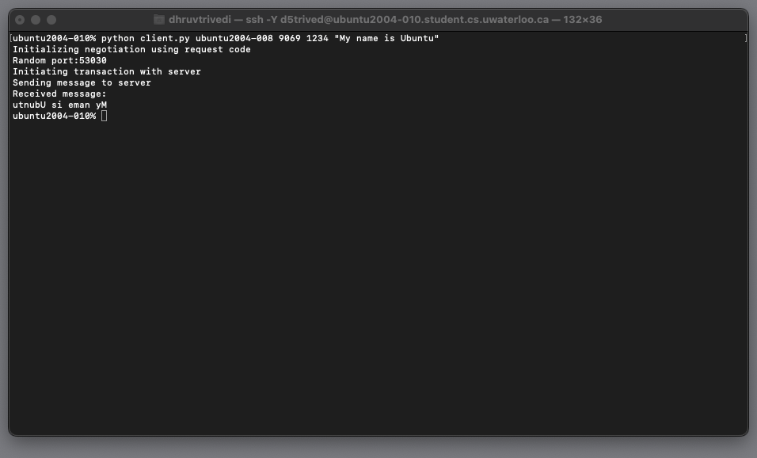
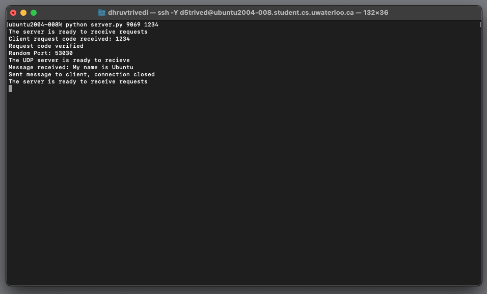

---

Computer Networks: Socket Programming
Author: Dhruv Trivedi
Course: CS 436 - Networks and Distributed Computer Systems
Instructor: Noura Limam


---

## Overview
This project provides a hands-on introduction to TCP and UDP socket programming within a client-server paradigm. The primary functionality is string reversal: a client sends a string to the server over a network, and the server returns its reverse.

The communication follows a two-stage process:
1. **Negotiation Stage**: Through the server's fixed negotiation port (`<n_port>`), the client and server determine a random port (`<r_port>`) for subsequent data transfer.
2. **Transaction Stage**: Actual data transfer happens where the client connects using the negotiated `<r_port>`.

---

## Running the Program

### Setting up the Server
1. Navigate to the project's `source` directory on your server machine:
    ```
    cd ./source
    ```
2. Start the server by entering:
    ```
    python server.py <n_port> <req_code>
    ```
    Where:
    - `<n_port>` is the TCP negotiation port number.
    - `<req_code>` is the request code against which the client's requests will be verified.

### Setting up the Client
1. Navigate to the project's `source` directory on your client machine:
    ```
    cd ./source
    ```
2. Start the client by entering:
    ```
    python client.py <server_address> <n_port> <req_code> <msg>
    ```
    Where:
    - `<server_address>` is the server's address (e.g., "ubuntu2004-008.student.cs.uwaterloo.ca" or "ubuntu2004-008").
    - `<n_port>` is the TCP negotiation port for server communication.
    - `<req_code>` is the client's request code for negotiation.
    - `<msg>` is the string that you'd like the server to reverse.

> **Note**: If the request codes on both the client and server match, the client sends the message to the server and receives its reverse.

---

## Testing Information
The program has been successfully tested on the following machines:

1. **Machine Details**:
   - **Hostname**: ubuntu2004-008.student.cs.uwaterloo.ca
   - **CPU Type**: Intel(R) Xeon(R) CPU E5-2697A v4 @ 2.60GHz
   - **Make**: Dell Inc.

2. **Machine Details**:
   - **Hostname**: ubuntu2004-010.student.cs.uwaterloo.ca
   - **CPU Type**: Intel(R) Xeon(R) Gold 6148 CPU @ 2.40GHz
   - **Make**: Supermicro

---

## Screenshots



---
